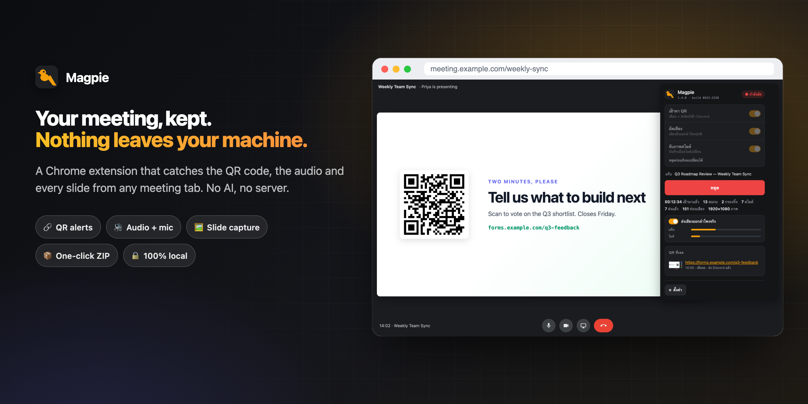
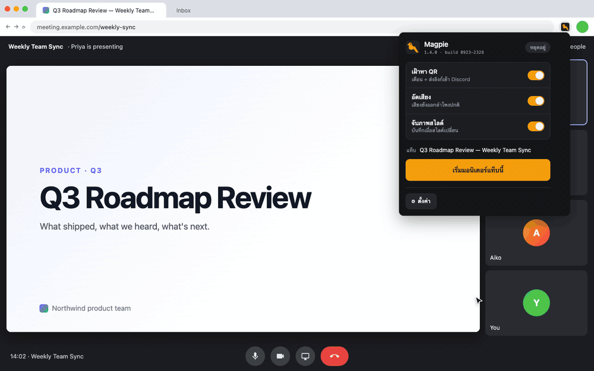
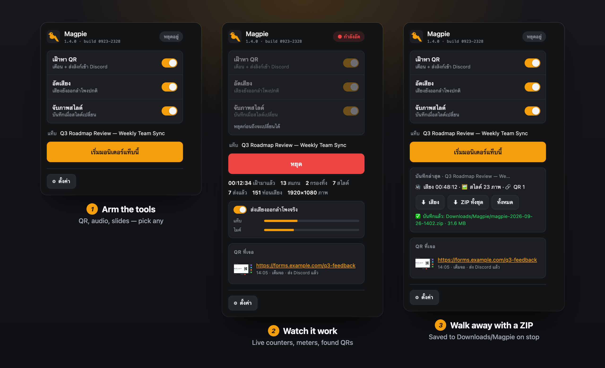
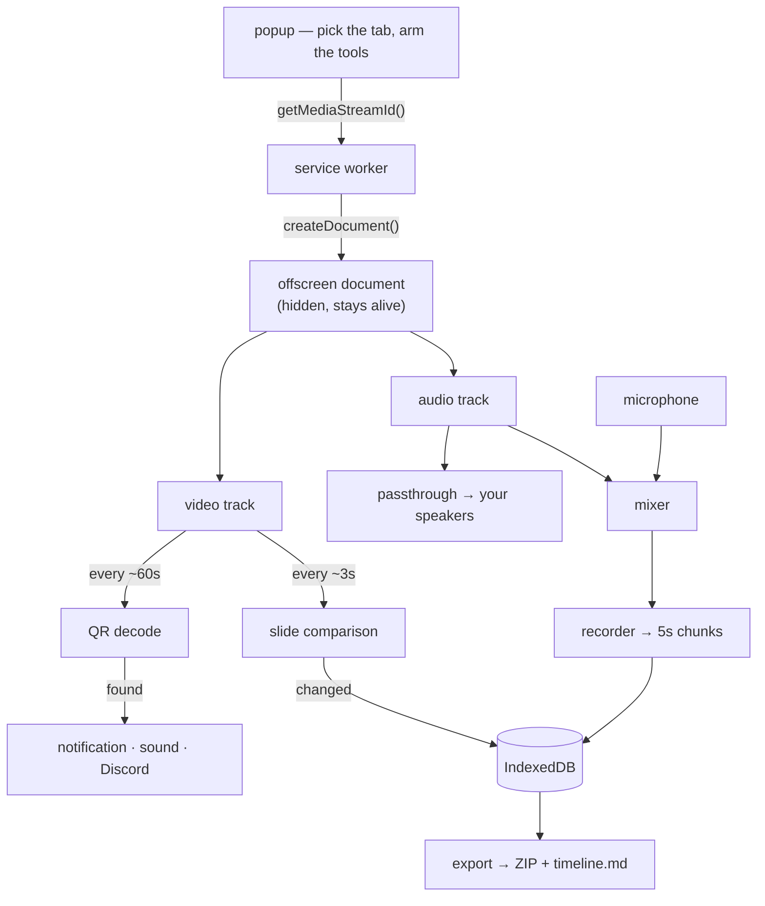

<div align="center">



# Magpie

**Collects what your meeting leaves behind.**

A Chrome extension that watches any meeting tab and keeps the parts worth keeping — the QR code that flashed past, the audio, and every slide that went up — without sending a single frame anywhere.

[](LICENSE)


**[Install in 30 seconds](#install)** · [See it in action](#-see-it-in-action) · [How it works](#how-it-works) · [Privacy](#privacy)

</div>

## ✨ What you get

| | Feature | What it does |
|---|---|---|
| 👁 | **QR watch** | Finds QR codes on the shared screen, alerts you with a sound and a notification, and pushes the link to Discord |
| 🚫 | **Deny-list** | LINE add-friend codes (`line.naver.jp`, `lin.ee`) are filtered by default — add your own, or an allow-list |
| 🔊 | **Virtual speaker** | Records the tab's audio while it keeps playing through your speakers, with your microphone mixed in or as a separate file |
| 🎧 | **MP3, encoded live** | 16 kHz mono MP3 at 32 kbps — about 14 MB an hour, small enough for transcription tools |
| 🖼 | **Slide capture** | Saves a screenshot each time the slide really changes, and ignores a moving webcam tile |
| 📨 | **Slides to Discord** | Each captured slide is posted to your webhook as it happens, so the deck follows you to your phone (can be turned off) |
| 📦 | **ZIP on stop** | Audio, slides, QR frames and a `timeline.md` land in `Downloads/Magpie/` the moment you press stop |
| 🗂 | **Session history** | Every meeting stays in IndexedDB on your machine — export again or delete from one page |
| 🔒 | **Nothing leaves** | No AI, no server, no account. The only outbound request is the Discord webhook you set |

Works with any meeting that runs in a Chrome tab: Zoom web client, Google Meet, Microsoft Teams, Webex, or a livestream. Nothing in it is tied to a particular platform — it reads pixels and audio from the tab you point it at.

## 🎬 See it in action

<p align="center">
  
  <br><em>Start on a meeting tab → slides are counted as they change → the QR on slide 3 is caught → stop, and the ZIP is saved.<br>Staged with a mock meeting and time compressed; the popup is the real UI (in Thai, its current language).</em>
</p>

## 🧭 Three states, one popup

<p align="center">
  
</p>

Tools lock while a session runs — they decide what the capture asks Chrome for, so changing them mid-meeting would silently do nothing. Stop, change, start again.

More screens: [saved sessions](docs/sessions.png) · [settings](docs/options.png)

## 🤔 Magpie or a meeting notetaker?

| | **Magpie** | AI notetaker (a bot joins the call) | The meeting app's own recording |
|---|---|---|---|
| Where the data goes | Your disk | The vendor's cloud | The platform's cloud or the host's drive |
| Needs the host's say-so | No | Often | Usually host-only or a paid plan |
| Transcript and summary | ❌ — you get an MP3 to feed any tool you like | ✅ | Varies |
| A still of every slide | ✅ | Varies | ❌ — a video you scrub through |
| Alerts when a QR code appears | ✅ | ❌ | ❌ |
| Desktop Zoom / Teams apps | ❌ — Chrome tabs only | ✅ | ✅ |
| Cost | Free, MIT | Free tier, then subscription | Included in some plans |

If you want a written summary without lifting a finger, a notetaker is the better tool. Magpie is for when the recording should never leave your machine, or when the thing you'll regret missing is a QR code or a slide rather than a sentence.

---

## Why this exists

Meetings leak things. A QR code appears for ninety seconds and you had looked away. A number gets said once and never written down. A slide with the one diagram you needed goes past in four seconds. The usual fix is to keep half your attention on the screen for an hour so you don't miss the two minutes that mattered.

That's a timing problem, and timing problems are what computers are for.

**What it does not do:** it does not fill in forms, fake your attendance, join meetings for you, or interpret anything. It notices, it saves, it tells you. What to do next is still yours.

---

## How it works



`chrome.tabCapture` opens one live stream of the tab. Three consumers read from it on their own schedules, each owning its own canvas so an async QR decode can never race a slide comparison.

**No AI, no model, no API key, no cost.** QR decoding uses Chrome's built-in `BarcodeDetector` (on macOS that is Apple's Vision framework); slide detection is arithmetic on downscaled pixels. `jsQR` ships bundled as a fallback because MV3 forbids loading scripts from the network at runtime.

### Why an offscreen document

MV3 tears down a service worker after roughly 30 seconds idle. Put a scan loop or a `MediaRecorder` there and **it dies silently mid-meeting** — the worst possible outcome, because you believe something is watching and recording when nothing is.

So the `MediaStream`, the analysers and the recorder all live in an [offscreen document](https://developer.chrome.com/docs/extensions/reference/api/offscreen), which Chrome keeps alive precisely because it holds media. A watchdog alarm and a `tabs.onRemoved` hook catch the rest, and say so out loud when they fire.

---

## 🔊 The virtual speaker

Capturing a tab's audio **mutes that tab**. Chrome hands you the stream and stops playing it. So passthrough is not a feature here, it is a repair:

```
tab ──┬─(passthrough gain)─→ speakers      ← toggleable, and you pick the device
      └─────────────────┐
mic ───(mic gain)───────┴─→ recorder       ← one mixed file, both sides of the call

                    …or, in separate mode:
tab ───────────────────────→ recorder      ← audio-tab.mp3
mic ───────────────────────→ recorder      ← audio-mic.mp3
```

The microphone is deliberately **never** routed to the speakers. Tab audio into your ears is correct; your own voice fed back into your ears is not.

**This is not a system audio device.** Tools like Loom install a macOS audio driver so a virtual device appears in every app's Speaker menu. A Chrome extension cannot create one. The trade:

| | Magpie (`tab` mode) | A system driver |
|---|---|---|
| Needs an install | no | yes |
| Appears in Zoom's Speaker list | no | yes |
| Works with desktop apps | no | yes |
| Works with meetings in a tab | yes | yes |
| Meeting app must be configured | **no** — it taps the audio before the device | yes |

The recording can be one mixed file or two separate ones — tab and microphone apart — which matters when you want to transcribe just the speaker without your own voice in the way.

---

## 🖼 Slide detection, and why a moving webcam doesn't fool it

Diffing raw pixels fails instantly in a meeting: a presenter's webcam tile changes every frame. So the question asked is not *how much did the picture change* but **what fraction of the screen changed**.

Each frame is reduced to 320×180, split into a 16×9 grid, and each of the 144 blocks is compared against the last saved slide. A change is only saved once it has also stopped moving, which is what stops a fade being captured half-finished.

Measured against synthetic slides with a webcam tile animating throughout:

| Situation | Fraction of screen changed | Result |
|---|---|---|
| Only the webcam tile moves | **2.1 – 2.8 %** | ignored ✅ |
| Mid-fade between two slides | 47.9 % | held, not saved ✅ |
| An actual slide change | **94.4 – 96.5 %** | captured ✅ |

The gap between noise and signal is roughly 35×, which is why the default 20 % threshold has so much room on either side. Every number above is adjustable.

### Slides to Discord

Captured slides can also be pushed to the webhook the moment they are taken, so a phone shows the deck as it happens. Two things measured against a live webhook before shipping it:

- The uploaded file is consumed by the embed's `attachment://` reference, so Discord returns it on `embeds[0].image.url` and leaves `attachments` empty — reading the wrong one silently stores a null link.
- Those CDN links **expire after about 24 hours** (`?ex=` in the URL). The file itself stays on the message forever and Discord refreshes the link when you open it; only hotlinking the URL from elsewhere breaks.

There is an option to free the local copy once Discord confirms the upload, and it only ever deletes after a confirmed response. Worth knowing before turning it on: **slides cost 0.4–8 MB per meeting while audio costs ~27 MB per hour**, so this saves the smaller half. Slides freed this way are not in the exported ZIP; `timeline.md` links to Discord for them instead.

<p align="center">
  
  <br><em>The test harness: two slides, and a webcam tile that never stops moving.</em>
</p>

---

## 👁 QR detection

Three passes, each only running if the previous one found nothing:

| Pass | What it does | Catches |
|---|---|---|
| 1 | Decode the whole frame | Normal-sized QR — ends here 90%+ of the time |
| 2 | 3×3 tiles, 15% overlap, upscaled 2× | A small QR in a slide corner |
| 3 | Invert the frame, decode again | White QR on a dark slide |

Measured with the bundled `jsQR` fallback (the native decoder does better) against slides re-compressed to imitate what a meeting actually transmits:

| Captured frame | Quality | QR size on screen | Result |
|---|---|---|---|
| 1920×1080 | q55 | down to 64px (0.2% of screen) | ✅ pass 1 |
| 1280×720 | q30 | 140–90px | ✅ pass 1 |
| 1280×720 | q30 | **80px** | ✅ **pass 1 missed it — tiling recovered it** |
| 1280×720 | q30 | ≤70px | ❌ unrecoverable |

Below roughly 1.5 pixels per QR module the information is destroyed by compression, and no amount of upscaling invents it back. Captured resolution matters far more than anything in the algorithm — so **maximise the window**.

### The deny-list

Speakers put a LINE add-friend QR on their intro slide. It fires an alert every time and is never what you were waiting for. So `line.naver.jp` and `lin.ee` ship as default deny-list entries, and you can delete them.

Order of decision: **cooldown → deny-list → allow-list → alert.** Cooldown comes first on purpose — a blocked QR sits on the slide for minutes, and filtering before deduping would count it again on every scan and make the "filtered" figure meaningless.

---

## What you get out

Press stop and the ZIP lands in **Downloads/Magpie/** on its own — closing the meeting tab does the same. (Options → ทั่วไป turns this off; the popup and the sessions page can still export any session by hand.)

```
magpie-2026-09-03-1432/
├── audio.mp3               tab audio + your microphone (or audio-tab / audio-mic if split)
├── slides/
│   ├── 001_00-03-12.jpg    filenames carry the offset into the recording
│   └── 002_00-07-45.jpg
├── qr/
│   └── 001_00-14-32.jpg    the frame each QR was read from
├── qr-codes.json
├── session.json
└── timeline.md             ← the part that makes it navigable
```

`timeline.md` puts everything on one clock, so months later you can find the moment you need:

| เวลา | เกิดอะไร |
|------|----------|
| 00:03:12 | 🖼 สไลด์ 001 — `slides/001_00-03-12.jpg` |
| 00:07:45 | 🖼 สไลด์ 002 — `slides/002_00-07-45.jpg` |
| 00:14:32 | 🔗 QR — https://forms.gle/aX9kQ2mNpR4vT8wZ · `qr/001_00-14-32.jpg` |

A bare URL is hard to place months later, so the whole frame the code was read from is kept next to it — the slide it was on says what the link was actually for. The picture is saved whether or not it was sent to Discord; sessions recorded before this feature have the link with no file.

**Why MP3, not WebM.** `MediaRecorder` in Chrome only really writes WebM/Opus — it reports `audio/mp4` AAC as supported and then hands back zero bytes. WebM is exactly the format transcription tools and LLM uploads reject most, so an AudioWorklet taps the same signal the recorder hears and encodes **16 kHz mono MP3 at 32 kbps** live (~14 MB an hour, under Whisper's 25 MB limit up to ~1.7 h). Encoding as you go means export never has to decode an hour of audio at once, and MP3 frames join cleanly, so the duration is correct.

The WebM recording is still made alongside as a fallback. It only appears in the ZIP for a track with no MP3 — sessions from older versions, or if the encoder failed to start (the popup says so). WebM assembled from streamed chunks has no duration in its header; `timeline.md` includes the `ffmpeg -i audio.webm -c copy audio-fixed.webm` fix in that case.

---

## Install

```bash
git clone https://github.com/tlejay/magpie.git
```

```
1. Open chrome://extensions
2. Enable Developer mode (top right)
3. Load unpacked → select the cloned folder
```

No build step, no `npm install`, no `node_modules`. Edit a file, hit Reload, done.

### Discord (optional, for QR alerts and slides)

```
Discord → Server Settings → Integrations → Webhooks → New Webhook → Copy Webhook URL
```

Paste it into **Options**, or:

```bash
cp src/config.example.js src/config.local.js   # then paste the URL inside
```

`src/config.local.js` is gitignored, so the secret stays on your machine while the options page is still pre-filled for you.

### Microphone

An offscreen document cannot raise a permission prompt, so a normal page has to ask on its behalf — Options → **เปิดหน้าอนุญาต**, once. If you decline, recording continues with tab audio only, and says so rather than quietly handing back a file that is missing half the conversation.

---

## Usage

1. Join the meeting **in a Chrome tab** (Zoom's "Join from your browser", Meet, Teams web, …).
2. Click the Magpie icon, arm the tools you want, then **เริ่มมอนิเตอร์แท็บนี้**.
3. The badge reads `ON` in green, or `REC` in red while recording.

Tools can't be switched mid-session: they decide what the capture asks Chrome for, which is fixed when the stream opens. Stop, change, start again.

**To maximise detection:** maximise the window and hide the participant panel. The bigger the shared area, the bigger the QR and the more of the frame a slide occupies.

---

## Settings

<p align="center">
  
  <br><em>The top of the options page. Every section is a tab along the top.</em>
</p>

Everything is adjustable: scan intervals, re-alert cooldown, deny- and allow-lists, alert sound and volume, audio bitrate and chunk size, one-file-or-two, passthrough and output device, microphone selection, whether slides go to Discord as they are captured, and every threshold in the slide detector.

The popup and the options page both print the loaded build (`1.4.0 · build 0923-2328`). Loading unpacked means iterating on code Chrome has already cached, and "did the reload take?" is otherwise a guess that costs a whole test round.

---

## Testing without a real meeting

Two harnesses ship with the extension, under **Options → ทดสอบ**.

**`test/qr-test.html`** — a QR appears after a countdown, at a size you choose, with a swappable payload and a dark-background mode. One of the three codes points at `lin.ee`, so you can watch the deny-list work.

**`test/slide-test.html`** — six slides you can advance manually, on a timer, or in a rapid burst, with an adjustable fade and a webcam tile that never stops moving.

```
Audio      play a video, start with recording on
           → you must still HEAR it  (silence = passthrough is broken)
           → toggle passthrough off and on; sound follows, REC stays
           → speak: the mic meter moves, and you must NOT hear yourself
Slides     leave it two minutes with the webcam moving → nothing saved
           → change a slide → one capture, within ~6 seconds
           → burst 5 changes → the settled slide, never a mid-animation frame
QR         forms.gle → alerts · lin.ee → filtered, and the counter goes up
           → drag the size down to 80px → still caught (tiling)
```

---

## Privacy

- Frames are analysed in memory and discarded. Nothing is written unless a QR is found or a slide changed.
- Recordings and slides live in IndexedDB **on your machine**. No server, no account, no telemetry.
- The only outbound request is the Discord webhook you configure. Snapshot attachment can be turned off.
- One host permission exists in the manifest: `https://discord.com/api/webhooks/*`.
- Nothing auto-starts. Every session needs an explicit click, and recording shows a red `REC` badge for as long as it runs.

> Many organisations — and the law in some places — require telling people before recording them. That is on you, not on the tool.

---

## Limitations

- **Meetings must run in a Chrome tab.** Desktop Zoom/Teams are invisible to an extension; supporting them would need a native macOS audio driver, which is a separate project.
- Very small or heavily compressed QR codes are unrecoverable — see the benchmark.
- Slide thresholds may need tuning for unusual layouts; every value is exposed.
- **Picture-in-Picture blanks the capture.** Popping the video out moves it to a floating window and leaves the tab empty, so the capture goes black. Found the hard way, in a real meeting, after a solid black slide had already been uploaded. Frames that dark are now detected and never saved, and the popup says why — but nothing is captured until PiP is closed.
- DRM-protected video (Netflix and friends) captures as black frames. Untested.
- Restarting Chrome ends the session. Deliberate: nothing should be capturing your screen silently.

---

## Project layout

```
manifest.json
src/service-worker.js      orchestrator: lifecycle, alerts, Discord, watchdog
src/offscreen.html/.js     the capture hub — one stream, three consumers
src/shared/qr.js           QR decode: native first, jsQR fallback, tiling, inversion
src/shared/slides.js       block-signature comparison + settle detection
src/shared/audio.js        Web Audio graph, passthrough, recorder, chunking
src/shared/db.js           IndexedDB: sessions, audio chunks, slides, QR hits
src/shared/export.js       ZIP assembly + timeline.md
src/popup.*                arm the tools, live meters, history
src/options.*              every setting
src/sessions.*             saved sessions: export or delete
src/permission.*           one-time microphone grant
src/config.local.js        🔒 your webhook URL (gitignored)
src/shared/pcm-tap.worklet.js  audio thread: mono + 16 kHz for the MP3 encoder
lib/                       jsqr.js, fflate.min.js, lame.min.js (lamejs 1.2.1, LGPL) — vendored, MV3 forbids CDN loads
test/                      QR and slide harnesses
```

---

## Contributing

Issues and pull requests are welcome. There is no build step: clone, **Load unpacked**, edit, **Reload**. Please read the rules at the top of [`CLAUDE.md`](CLAUDE.md) first — most of them exist because breaking them silently loses a whole meeting (a muted tab, a dead recorder, your own voice in your ears).

## License

MIT — see [LICENSE](LICENSE).

Built by [Tle](https://madebytle.com) with [Claude Code](https://claude.com/claude-code).

<div align="center">

**If Magpie ever catches the QR code you were about to miss, a ⭐ helps other people find it.**

</div>
