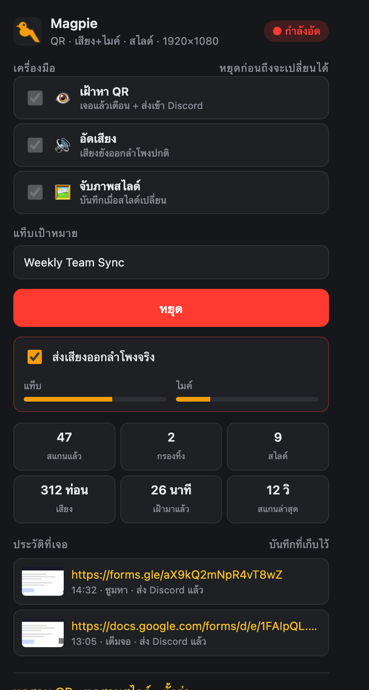
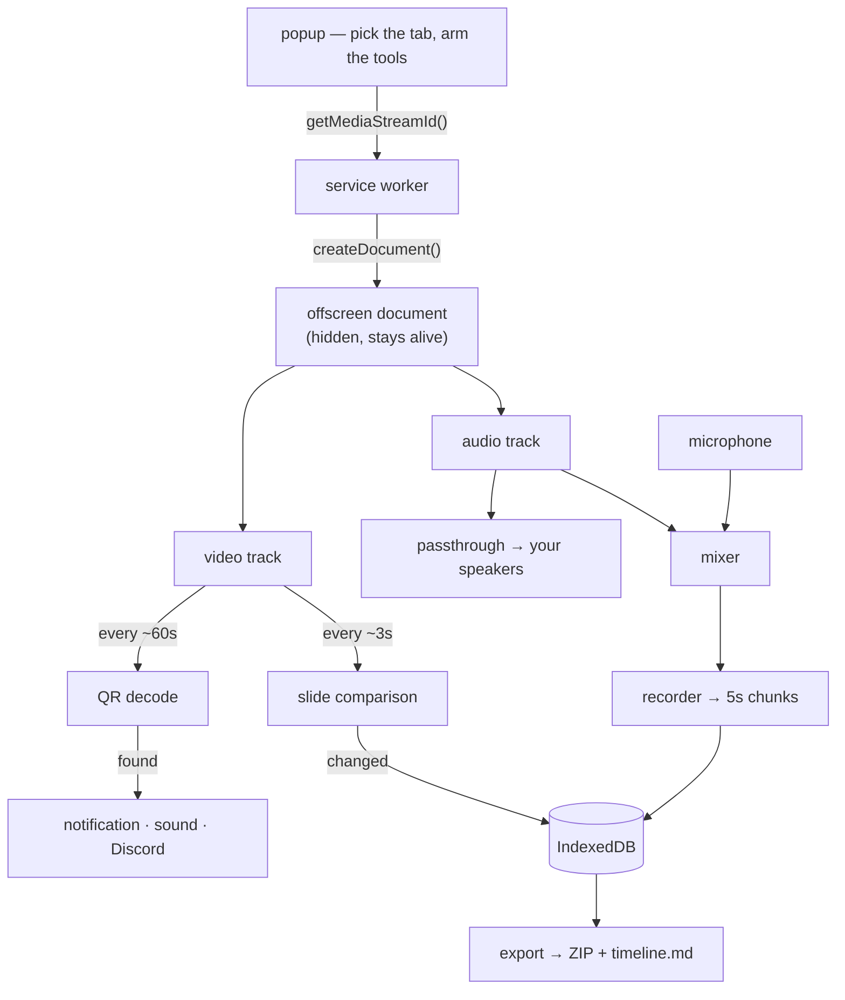
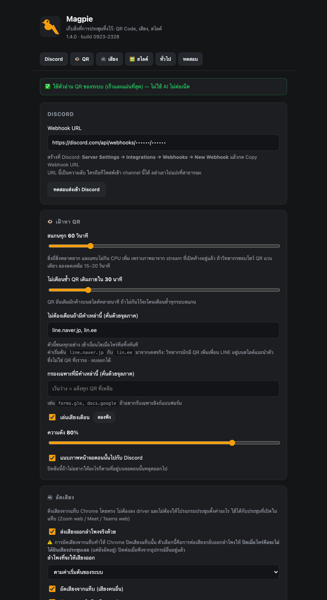

# Magpie

**Collects what your meeting leaves behind.**
A Chrome extension that watches any meeting tab and keeps the parts worth keeping — the QR code that flashed past, the audio, and every slide that went up — without sending a single frame anywhere.


<p align="center">
  
</p>

| | |
|---|---|
| 👁 **Watch** | Finds QR codes on screen, alerts you, and pushes the link to Discord |
| 🔊 **Listen** | A virtual speaker — audio still plays normally while a copy is recorded locally, mixed with your microphone |
| 🖼 **Collect** | Saves a screenshot every time the slide actually changes, decided by comparing images on your machine |

Works with any meeting that runs in a Chrome tab: Zoom web client, Google Meet, Microsoft Teams, Webex, or a livestream. Nothing in it is tied to a particular platform — it reads pixels and audio from the tab you point it at.

---

## Why this exists

Meetings leak things. A QR code appears for ninety seconds and you had looked away. A number gets said once and never written down. A slide with the one diagram you needed goes past in four seconds. The usual fix is to keep half your attention on the screen for an hour so you don't miss the two minutes that mattered.

That's a timing problem, and timing problems are what computers are for.

**What it does not do:** it does not fill in forms, fake your attendance, join meetings for you, or interpret anything. It notices, it saves, it tells you. What to do next is still yours.

---

## How it works



`chrome.tabCapture` opens one live stream of the tab. Three consumers read from it on their own schedules, each owning its own canvas so an async QR decode can never race a slide comparison.

**No AI, no model, no API key, no cost.** QR decoding uses Chrome's built-in `BarcodeDetector` (on macOS that is Apple's Vision framework); slide detection is arithmetic on downscaled pixels. `jsQR` ships bundled as a fallback because MV3 forbids loading scripts from the network at runtime.

### Why an offscreen document

MV3 tears down a service worker after roughly 30 seconds idle. Put a scan loop or a `MediaRecorder` there and **it dies silently mid-meeting** — the worst possible outcome, because you believe something is watching and recording when nothing is.

So the `MediaStream`, the analysers and the recorder all live in an [offscreen document](https://developer.chrome.com/docs/extensions/reference/api/offscreen), which Chrome keeps alive precisely because it holds media. A watchdog alarm and a `tabs.onRemoved` hook catch the rest, and say so out loud when they fire.

---

## 🔊 The virtual speaker

Capturing a tab's audio **mutes that tab**. Chrome hands you the stream and stops playing it. So passthrough is not a feature here, it is a repair:

```
tab ──┬─(passthrough gain)─→ speakers      ← toggleable, and you pick the device
      └─────────────────┐
mic ───(mic gain)───────┴─→ recorder       ← one mixed file, both sides of the call

                    …or, in separate mode:
tab ───────────────────────→ recorder      ← audio-tab.webm
mic ───────────────────────→ recorder      ← audio-mic.webm
```

The microphone is deliberately **never** routed to the speakers. Tab audio into your ears is correct; your own voice fed back into your ears is not.

**This is not a system audio device.** Tools like Loom install a macOS audio driver so a virtual device appears in every app's Speaker menu. A Chrome extension cannot create one. The trade:

| | Magpie (`tab` mode) | A system driver |
|---|---|---|
| Needs an install | no | yes |
| Appears in Zoom's Speaker list | no | yes |
| Works with desktop apps | no | yes |
| Works with meetings in a tab | yes | yes |
| Meeting app must be configured | **no** — it taps the audio before the device | yes |

The recording can be one mixed file or two separate ones — tab and microphone apart — which matters when you want to transcribe just the speaker without your own voice in the way.

---

## 🖼 Slide detection, and why a moving webcam doesn't fool it

Diffing raw pixels fails instantly in a meeting: a presenter's webcam tile changes every frame. So the question asked is not *how much did the picture change* but **what fraction of the screen changed**.

Each frame is reduced to 320×180, split into a 16×9 grid, and each of the 144 blocks is compared against the last saved slide. A change is only saved once it has also stopped moving, which is what stops a fade being captured half-finished.

Measured against synthetic slides with a webcam tile animating throughout:

| Situation | Fraction of screen changed | Result |
|---|---|---|
| Only the webcam tile moves | **2.1 – 2.8 %** | ignored ✅ |
| Mid-fade between two slides | 47.9 % | held, not saved ✅ |
| An actual slide change | **94.4 – 96.5 %** | captured ✅ |

The gap between noise and signal is roughly 35×, which is why the default 20 % threshold has so much room on either side. Every number above is adjustable.

<p align="center">
  
  <br><em>The test harness: two slides, and a webcam tile that never stops moving.</em>
</p>

---

## 👁 QR detection

Three passes, each only running if the previous one found nothing:

| Pass | What it does | Catches |
|---|---|---|
| 1 | Decode the whole frame | Normal-sized QR — ends here 90%+ of the time |
| 2 | 3×3 tiles, 15% overlap, upscaled 2× | A small QR in a slide corner |
| 3 | Invert the frame, decode again | White QR on a dark slide |

Measured with the bundled `jsQR` fallback (the native decoder does better) against slides re-compressed to imitate what a meeting actually transmits:

| Captured frame | Quality | QR size on screen | Result |
|---|---|---|---|
| 1920×1080 | q55 | down to 64px (0.2% of screen) | ✅ pass 1 |
| 1280×720 | q30 | 140–90px | ✅ pass 1 |
| 1280×720 | q30 | **80px** | ✅ **pass 1 missed it — tiling recovered it** |
| 1280×720 | q30 | ≤70px | ❌ unrecoverable |

Below roughly 1.5 pixels per QR module the information is destroyed by compression, and no amount of upscaling invents it back. Captured resolution matters far more than anything in the algorithm — so **maximise the window**.

### The deny-list

Speakers put a LINE add-friend QR on their intro slide. It fires an alert every time and is never what you were waiting for. So `line.naver.jp` and `lin.ee` ship as default deny-list entries, and you can delete them.

Order of decision: **cooldown → deny-list → allow-list → alert.** Cooldown comes first on purpose — a blocked QR sits on the slide for minutes, and filtering before deduping would count it again on every scan and make the "filtered" figure meaningless.

---

## What you get out

Each session exports as one ZIP:

```
magpie-2026-09-03-1432/
├── audio.webm              tab audio + your microphone (or audio-tab / audio-mic if split)
├── slides/
│   ├── 001_00-03-12.jpg    filenames carry the offset into the recording
│   └── 002_00-07-45.jpg
├── qr-codes.json
├── session.json
└── timeline.md             ← the part that makes it navigable
```

`timeline.md` puts everything on one clock, so months later you can find the moment you need:

| เวลา | เกิดอะไร |
|------|----------|
| 00:03:12 | 🖼 สไลด์ 001 — `slides/001_00-03-12.jpg` |
| 00:07:45 | 🖼 สไลด์ 002 — `slides/002_00-07-45.jpg` |
| 00:14:32 | 🔗 QR — https://forms.gle/aX9kQ2mNpR4vT8wZ |

> A recorder writes its file header before it knows the duration, so audio assembled from streamed chunks reports an unknown length. It plays fine everywhere; if a player refuses to seek, `ffmpeg -i audio.webm -c copy audio-fixed.webm` rewrites the header. The exported `timeline.md` says so too, rather than leaving you to find out.

---

## Install

```bash
git clone https://github.com/tlejay/magpie.git
```

```
1. Open chrome://extensions
2. Enable Developer mode (top right)
3. Load unpacked → select the cloned folder
```

No build step, no `npm install`, no `node_modules`. Edit a file, hit Reload, done.

### Discord (optional, for the QR alerts)

```
Discord → Server Settings → Integrations → Webhooks → New Webhook → Copy Webhook URL
```

Paste it into **Options**, or:

```bash
cp src/config.example.js src/config.local.js   # then paste the URL inside
```

`src/config.local.js` is gitignored, so the secret stays on your machine while the options page is still pre-filled for you.

### Microphone

An offscreen document cannot raise a permission prompt, so a normal page has to ask on its behalf — Options → **เปิดหน้าอนุญาต**, once. If you decline, recording continues with tab audio only, and says so rather than quietly handing back a file that is missing half the conversation.

---

## Usage

1. Join the meeting **in a Chrome tab** (Zoom's "Join from your browser", Meet, Teams web, …).
2. Click the Magpie icon, arm the tools you want, then **เริ่มมอนิเตอร์แท็บนี้**.
3. The badge reads `ON` in green, or `REC` in red while recording.

Tools can't be switched mid-session: they decide what the capture asks Chrome for, which is fixed when the stream opens. Stop, change, start again.

**To maximise detection:** maximise the window and hide the participant panel. The bigger the shared area, the bigger the QR and the more of the frame a slide occupies.

---

## Settings

<p align="center">
  
</p>

Everything is adjustable: scan intervals, re-alert cooldown, deny- and allow-lists, alert sound and volume, whether snapshots reach Discord, audio bitrate and chunk size, one-file-or-two, passthrough and output device, microphone selection, and every threshold in the slide detector.

---

## Testing without a real meeting

Two harnesses ship with the extension, reachable from the popup footer.

**`test/qr-test.html`** — a QR appears after a countdown, at a size you choose, with a swappable payload and a dark-background mode. One of the three codes points at `lin.ee`, so you can watch the deny-list work.

**`test/slide-test.html`** — six slides you can advance manually, on a timer, or in a rapid burst, with an adjustable fade and a webcam tile that never stops moving.

```
Audio      play a video, start with recording on
           → you must still HEAR it  (silence = passthrough is broken)
           → toggle passthrough off and on; sound follows, REC stays
           → speak: the mic meter moves, and you must NOT hear yourself
Slides     leave it two minutes with the webcam moving → nothing saved
           → change a slide → one capture, within ~6 seconds
           → burst 5 changes → the settled slide, never a mid-animation frame
QR         forms.gle → alerts · lin.ee → filtered, and the counter goes up
           → drag the size down to 80px → still caught (tiling)
```

---

## Privacy

- Frames are analysed in memory and discarded. Nothing is written unless a QR is found or a slide changed.
- Recordings and slides live in IndexedDB **on your machine**. No server, no account, no telemetry.
- The only outbound request is the Discord webhook you configure. Snapshot attachment can be turned off.
- One host permission exists in the manifest: `https://discord.com/api/webhooks/*`.
- Nothing auto-starts. Every session needs an explicit click, and recording shows a red `REC` badge for as long as it runs.

> Many organisations — and the law in some places — require telling people before recording them. That is on you, not on the tool.

---

## Limitations

- **Meetings must run in a Chrome tab.** Desktop Zoom/Teams are invisible to an extension; supporting them would need a native macOS audio driver, which is a separate project.
- Very small or heavily compressed QR codes are unrecoverable — see the benchmark.
- Slide thresholds may need tuning for unusual layouts; every value is exposed.
- DRM-protected video (Netflix and friends) captures as black frames. Untested.
- Restarting Chrome ends the session. Deliberate: nothing should be capturing your screen silently.

---

## Project layout

```
manifest.json
src/service-worker.js      orchestrator: lifecycle, alerts, Discord, watchdog
src/offscreen.html/.js     the capture hub — one stream, three consumers
src/shared/qr.js           QR decode: native first, jsQR fallback, tiling, inversion
src/shared/slides.js       block-signature comparison + settle detection
src/shared/audio.js        Web Audio graph, passthrough, recorder, chunking
src/shared/db.js           IndexedDB: sessions, audio chunks, slides, QR hits
src/shared/export.js       ZIP assembly + timeline.md
src/popup.*                arm the tools, live meters, history
src/options.*              every setting
src/sessions.*             saved sessions: export or delete
src/permission.*           one-time microphone grant
src/config.local.js        🔒 your webhook URL (gitignored)
lib/                       jsqr.js, fflate.min.js — vendored, MV3 forbids CDN loads
test/                      QR and slide harnesses
```

---

## License

MIT — see [LICENSE](LICENSE).

Built by [Tle](https://madebytle.com) with [Claude Code](https://claude.com/claude-code).
