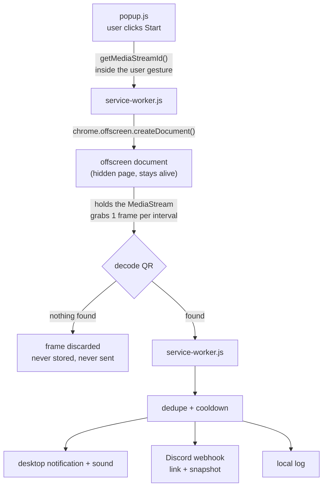
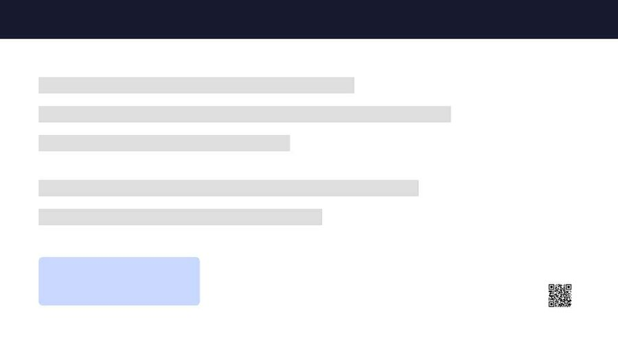

# Zoom QR Watcher

**A Chrome extension that watches your Zoom tab so you don't have to.**
When a QR code appears on the shared screen, it fires a desktop notification, plays a sound, and pushes the decoded link to Discord — so you don't have to keep half an eye on the screen the whole way through.


<p align="center">
  
</p>

---

## Why this exists

Many webinars put a QR code on screen partway through, linking to an attendance or feedback form you need to submit to be counted. It can show up at any point, usually without warning — so the only reliable way not to miss it is to keep watching the screen the entire session.

That's a timing problem, and timing problems are what computers are for. This keeps watch for you, so you can follow the session on your own terms and still catch the form the moment it goes up.

**What it does not do:** it does not fill in the form, fake your attendance, or interact with Zoom in any way. It tells you a QR code appeared. You still do the rest.

---

## How it works



1. `chrome.tabCapture` opens a live video stream of the Zoom tab — like screen sharing, but to yourself.
2. Every N seconds one frame is drawn to an in-memory canvas.
3. Chrome's built-in `BarcodeDetector` decodes it. On macOS that's Apple's Vision framework: fast, accurate, offline.
4. Found → alert. Not found → the frame is dropped immediately.

**No AI, no LLM, no API keys, no cost.** This is plain barcode decoding. `jsQR` ships bundled as a fallback because MV3 forbids loading scripts from the network at runtime.

### Why an offscreen document?

MV3 tears down a service worker after ~30s idle. Put the scan loop there and **the monitor dies silently mid-lecture** — the worst possible outcome, because you believe a guard is watching when it isn't.

So the `MediaStream` and the scan loop live in an [offscreen document](https://developer.chrome.com/docs/extensions/reference/api/offscreen), which Chrome keeps alive precisely because it holds media. A watchdog alarm plus a `tabs.onRemoved` hook catch the remaining ways it can break, and tell you out loud when they do.

---

## Install

```bash
git clone https://github.com/tlejay/ZOOM-QR-Watcher.git
```

```
1. Open chrome://extensions
2. Enable Developer mode (top right)
3. Load unpacked → select the cloned folder
```

No build step, no `npm install`, no `node_modules`. Edit a file, hit Reload, done.

### Connect Discord (optional but the whole point)

```
Discord → Server Settings → Integrations → Webhooks → New Webhook → Copy Webhook URL
```

Then either paste it into the extension's **Options** page, or:

```bash
cp src/config.example.js src/config.local.js
# paste the URL into config.local.js
```

`src/config.local.js` is gitignored — the secret stays on your machine. The service worker reads it once on install to pre-fill Options.

> Install the Discord mobile app and enable notifications for that channel, and the alert reaches your phone.

---

## Usage

1. Join the webinar via the **Zoom web client** ("Join from your browser"), not the desktop app.
2. On the Zoom tab, click the extension icon → **Start monitoring this tab**.
3. Green `ON` badge = the watcher is on duty. You're covered if a QR goes up.

**To maximise detection:** maximise the Chrome window and hide the participant panel. The bigger the shared screen area, the bigger the QR in the captured frame — and as the benchmark below shows, captured resolution matters far more than anything in the algorithm.

---

## Detection benchmark

Measured with the bundled `jsQR` fallback (the native decoder does better) against synthetic slides re-compressed as JPEG to imitate what Zoom actually transmits:

| Captured frame | Quality | QR size on screen | Result |
|---|---|---|---|
| 1920×1080 | q55 | 400px → 64px (0.2% of screen) | ✅ decoded on pass 1 |
| 1280×720 | q30 | 140–90px | ✅ decoded on pass 1 |
| 1280×720 | q30 | **80px** | ✅ **pass 1 missed it — tiling recovered it** |
| 1280×720 | q30 | ≤70px | ❌ unrecoverable |

Below roughly **1.5 pixels per QR module** the information is destroyed by compression. Upscaling afterwards cannot invent it back. This is why the extension captures at up to 1920×1080 and why window size is the single biggest lever you control.

<p align="center">
  
  <br><em>The 80px case: invisible to a whole-frame decode, recovered by pass 2.</em>
</p>

### The three decode passes

| Pass | What it does | Catches |
|---|---|---|
| 1 | Decode the whole frame at once | Normal-sized QR — ends here 90%+ of the time |
| 2 | 3×3 tiles, 15% overlap, upscaled 2× | Small QR tucked in a slide corner |
| 3 | Invert the frame, decode again | White QR on a dark slide |

Pass 2 only runs when pass 1 finds nothing, so the usual cost is a single decode per minute.

---

## Settings

<p align="center">
  
</p>

| Setting | Default | Notes |
|---|---|---|
| Discord webhook URL | from `config.local.js` | includes a "send test" button that surfaces the real HTTP status |
| Scan interval | 60s | 10–300s. More frequent costs almost nothing — the stream is already open |
| Re-alert cooldown | 30 min | the same QR stays on a slide for minutes; without this you'd be alerted every scan |
| Keyword filter | empty (alert on all) | e.g. `forms.gle, docs.google` to ignore promotional QRs on slides |
| Alert sound | on | volume adjustable |
| Attach snapshot to Discord | on | turn off if you don't want whatever else is on screen leaving the machine |
| Keep display awake | on | a sleeping display means Zoom stops rendering and every scan sees a frozen frame |
| History size | 50 | |

---

## Testing without a real webinar

Click the extension icon → **เปิดหน้าทดสอบ / Open test page**. It simulates a presenter switching to a slide with a QR on it: adjustable delay, adjustable size, swappable payload, and a dark-background mode.

```
1. Set the interval to 10s in Options so you're not waiting around
2. Open the test page → Start countdown
3. Click the extension icon → Start monitoring this tab
4. When the QR appears you should get all four:
   ✅ notification   ✅ sound   ✅ Discord message with image   ✅ log entry in the popup
5. Wait 2–3 more scans → it must NOT alert again  (dedupe works)
6. Drag "size" down to 80–100px → must still be caught  (tiling works)
7. Swap to the other QR → must alert  (different payload = different code)
8. Toggle dark background → must still be caught  (inversion pass works)
```

Reset the interval to 60s afterwards.

---

## Privacy

- Frames are decoded in memory and discarded. Nothing is written to disk unless a QR is found.
- The only outbound request is the Discord webhook you configure yourself. Snapshot attachment can be turned off.
- No analytics, no telemetry, no third-party hosts. The manifest grants exactly one host permission: `https://discord.com/api/webhooks/*`.
- Audio is deliberately **not** captured — requesting tab audio would mute the webinar for you.
- Monitoring never auto-starts. It requires an explicit click every session, by design.

---

## Limitations

- **Zoom web client only.** The desktop app is invisible to a Chrome extension. Supporting it would mean switching to `chrome.desktopCapture` and granting Chrome macOS Screen Recording permission.
- A 60-second interval can still miss a QR shown for less than a minute. Lower it to 15–20s if your presenter is quick.
- Very small or heavily compressed QRs are unrecoverable — see the benchmark.
- Restarting Chrome stops monitoring; you must start it again. That's intentional, so nothing captures your screen silently.

---

## Project layout

```
manifest.json              MV3 manifest
src/service-worker.js      orchestrator: offscreen lifecycle, dedupe, Discord, watchdog
src/offscreen.html/.js     hidden page holding the stream + the scan loop
src/shared/qr.js           decoder: native first, jsQR fallback, tiling, inversion
src/shared/storage.js      settings / state / log / seen-payload tracking
src/popup.*                start-stop control, stats, history
src/options.*              settings page
src/config.local.js        🔒 your webhook URL (gitignored)
lib/jsqr.js                bundled fallback decoder
test/qr-test.html          test harness
```

---

<details>
<summary><h2>🇹🇭 ภาษาไทย</h2></summary>

### ทำไมถึงมีตัวนี้

webinar หลายงานจะโชว์ QR Code ขึ้นมากลางคาบ ปลายทางเป็นแบบฟอร์มลงชื่อเข้าร่วมหรือแบบประเมินที่ต้องกรอกถึงจะนับ ซึ่งมันโผล่ตอนไหนก็ได้และมักไม่มีสัญญาณบอกล่วงหน้า วิธีเดียวที่จะไม่พลาดคือต้องคอยชำเลืองดูจอไว้ตลอดทั้งคาบ

นี่เป็นปัญหาเรื่องจังหวะเวลา ซึ่งเป็นงานที่เครื่องทำได้ดีกว่าคน ตัวนี้เลยคอยดูให้ เราจะได้ตั้งใจฟังตามจังหวะของตัวเอง แล้วยังกดกรอกฟอร์มได้ทันตอนมันขึ้น

**สิ่งที่มันไม่ทำ:** ไม่กรอกฟอร์มให้ ไม่ปลอมการเข้าเรียน ไม่ยุ่งกับ Zoom เลย มันแค่บอกว่า "QR ขึ้นแล้วนะ" ที่เหลือเรากรอกเอง

### หลักการทำงาน

เปรียบเทียบง่าย ๆ: มันคือ **ยามที่นั่งจ้องจอแทนเรา**

1. ต่อสายภาพสดเข้ากับแท็บ Zoom ผ่าน `chrome.tabCapture` (เหมือนแชร์หน้าจอ แต่แชร์ให้ตัวเอง)
2. ทุก N วินาที ถ่ายภาพนิ่ง 1 เฟรมลง canvas ในหน่วยความจำ
3. โยนให้ตัวอ่าน QR ในตัวของ Chrome (`BarcodeDetector`) ถอดรหัส — บน macOS คือ Vision framework ของ Apple เร็ว แม่น ไม่ต้องต่อเน็ต
4. เจอ → เด้งเตือน + เสียง + ยิง Discord + เก็บ log · ไม่เจอ → ทิ้งภาพนั้นทันที

**ไม่ใช้ AI ไม่ใช้ LLM ไม่มีค่า API** เป็นการถอดรหัสบาร์โค้ดตรง ๆ ทำงานในเครื่องล้วน

### ทำไมต้องมี offscreen document

MV3 ฆ่า service worker ทิ้งเมื่อ idle ประมาณ 30 วินาที ถ้าเอาลูปสแกนไว้ตรงนั้น **มอนิเตอร์จะตายเงียบ ๆ กลางคาบ** ซึ่งเป็นผลลัพธ์ที่แย่ที่สุด เพราะเราจะคิดว่ามียามเฝ้าอยู่ทั้งที่ยามหลับไปแล้ว

stream กับลูปสแกนจึงอยู่ใน offscreen document ที่ Chrome ยอมให้เปิดค้างเพราะกำลังถือ media อยู่ แล้วมี watchdog ทุก 2 นาที บวกกับ hook ตอนแท็บถูกปิด คอยจับกรณีที่เหลือ และ **บอกออกมาดัง ๆ** เวลาหลุด

### ติดตั้ง

```
1. เปิด chrome://extensions
2. เปิด Developer mode (มุมขวาบน)
3. กด Load unpacked แล้วเลือกโฟลเดอร์นี้
```

ไม่มี build step ไม่ต้อง npm install แก้ไฟล์ → กด Reload → เห็นผลทันที

### ตั้ง Discord

```
Discord → Server Settings → Integrations → Webhooks → New Webhook → Copy Webhook URL
```

เอา URL ไปวางในหน้า Options หรือก๊อป `src/config.example.js` เป็น `src/config.local.js` แล้ววางในนั้น
ไฟล์ `config.local.js` อยู่ใน `.gitignore` — URL ไม่มีทางหลุดขึ้น GitHub

> ลง Discord app บนมือถือแล้วเปิด notification ของ channel นั้น จะได้เตือนถึงมือถือด้วย

### วิธีใช้จริง

1. เข้า webinar ผ่าน **Zoom web client** (ตอนกดลิงก์ให้เลือก "Join from your browser") ไม่ใช่โปรแกรม Zoom
2. อยู่ที่แท็บ Zoom → กดไอคอน extension → **เริ่มมอนิเตอร์แท็บนี้**
3. เห็น badge เขียว `ON` = ยามเริ่มทำงานแล้ว ถ้า QR ขึ้นตอนไหนจะรู้ทัน

**เพื่อให้จับได้แน่ ๆ:** ขยายหน้าต่าง Chrome ให้เต็มจอ และซ่อน participant panel — ยิ่ง share screen กินพื้นที่มาก QR ในภาพยิ่งใหญ่ ซึ่งจากผลทดสอบข้างบน ความละเอียดของภาพสำคัญกว่าอัลกอริทึมมาก

### ผลทดสอบตัวถอดรหัส

ทดสอบด้วย jsQR (ตัวสำรอง — ของระบบดีกว่านี้) บนสไลด์จำลองที่บีบอัดแบบเดียวกับที่ Zoom ส่งจริง:

| ภาพที่จับได้ | คุณภาพ | ขนาด QR บนจอ | ผล |
|---|---|---|---|
| 1920×1080 | q55 | 400px ลงไปถึง 64px (0.2% ของจอ) | ✅ อ่านได้ตั้งแต่รอบแรก |
| 1280×720 | q30 | 140–90px | ✅ อ่านได้รอบแรก |
| 1280×720 | q30 | **80px** | ✅ **รอบแรกพลาด ระบบซูมหาเก็บได้** |
| 1280×720 | q30 | 70px ลงไป | ❌ ข้อมูลหายถาวร |

ต่ำกว่าประมาณ **1.5 พิกเซลต่อ 1 ช่องของ QR** คือจุดที่ข้อมูลถูกการบีบอัดทำลายไปแล้ว ขยายภาพทีหลังก็ไม่ช่วย

### การอ่าน 3 ชั้น

| ชั้น | ทำอะไร | จับเคสไหน |
|---|---|---|
| 1 | อ่านทั้งเฟรมรวดเดียว | QR ขนาดปกติ — จบที่นี่ 90%+ |
| 2 | หั่น 3×3 ซ้อนขอบ 15% ขยาย 2 เท่า | QR เล็กมุมสไลด์ที่ชั้น 1 มองข้าม |
| 3 | กลับสีทั้งเฟรม อ่านอีกรอบ | สไลด์พื้นดำ QR ขาว |

ชั้น 2 ทำงานเฉพาะตอนชั้น 1 ไม่เจอ ปกติจึงเสียแค่การอ่าน 1 ครั้งต่อนาที

### ทดสอบก่อนใช้งานจริง

กดไอคอน extension → **เปิดหน้าทดสอบ** จะได้หน้าที่จำลอง "วิทยากรกดสไลด์แล้ว QR โผล่" ปรับเวลา ปรับขนาด สลับ payload และเปิดพื้นดำได้

```
1. ตั้ง interval ใน Options เป็น 10 วินาที จะได้ไม่ต้องรอนาน
2. เปิดหน้าทดสอบ → กด "เริ่มนับถอยหลัง"
3. รีบกดไอคอน extension → "เริ่มมอนิเตอร์แท็บนี้"
4. พอ QR โผล่ ต้องได้ครบ 4 อย่าง:
   ✅ notification เด้ง  ✅ มีเสียง  ✅ ข้อความ+รูปเข้า Discord  ✅ log ขึ้นใน popup
5. ปล่อยอีก 2-3 รอบ → ต้องไม่เตือนซ้ำ (ระบบกันสแปมทำงาน)
6. ลากแถบ "ขนาด" ลงมาเหลือ 80–100px → ต้องยังจับได้ (ระบบซูมหาทำงาน)
7. กด "สลับเป็น QR อีกอัน" → ต้องเตือนใหม่ (คนละ payload = คนละอัน)
8. เปิด "พื้นดำ" → ต้องยังจับได้ (การอ่านแบบกลับสีทำงาน)
```

ทดสอบเสร็จอย่าลืมตั้ง interval กลับเป็น 60 วินาที

### ความเป็นส่วนตัว

- ภาพถูกถอดรหัสในหน่วยความจำแล้วทิ้งทันที ไม่เขียนลงดิสก์ ยกเว้นตอนเจอ QR
- request ที่ออกนอกเครื่องมีอย่างเดียวคือ Discord webhook ที่เราตั้งเอง และปิดการแนบรูปได้
- ไม่มี analytics ไม่มี telemetry ไม่มี host อื่น — manifest ขอสิทธิ์ host แค่ `https://discord.com/api/webhooks/*` ตัวเดียว
- **ไม่จับเสียง** โดยตั้งใจ เพราะ tab capture ที่ขอเสียงจะ mute เสียง webinar ไปด้วย
- ไม่เริ่มทำงานเอง ต้องกดเริ่มทุกครั้ง — ตั้งใจให้เป็นแบบนี้ จะได้ไม่มีอะไรแอบจับภาพจอเงียบ ๆ

### ข้อจำกัด

- **ใช้ได้เฉพาะ Zoom web client** โปรแกรม Zoom บนเครื่อง extension มองไม่เห็น (ถ้าจะรองรับต้องเปลี่ยนไปใช้ `chrome.desktopCapture` ซึ่งต้องขอสิทธิ์ Screen Recording ของ macOS)
- รอบ 60 วินาที ยังมีโอกาสพลาดถ้าวิทยากรโชว์ QR ไม่ถึงนาที — ลดเหลือ 15–20 วิ ได้
- QR ที่เล็กหรือเบลอเกินไปอ่านไม่ออก ดูตารางผลทดสอบข้างบน
- รีสตาร์ต Chrome แล้วต้องกดเริ่มมอนิเตอร์ใหม่ (ตั้งใจ)

</details>

---

## License

MIT — see [LICENSE](LICENSE).

Built by [Tle](https://madebytle.com) with [Claude Code](https://claude.com/claude-code).
